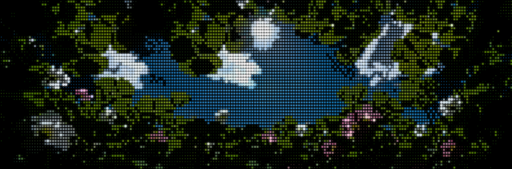

# 🌥️ Julian Peter B. Gerona

**`Future Full-stack Developer`**

👋 Hi! I'm Julian, an up-and-coming software developer from  **Calamba, Laguna**. I'm currently a 4th year college student at [Mapúa Malayan Colleges Laguna], pursuing an undergraduate degree in Information Technology and specializing in Cybersecurity. I have a strong interest in building user interfaces that simplify and humanize digital experiences.

<!-- Introduction links -->
[Mapúa Malayan Colleges Laguna]: https://mcl.edu.ph/

---

### ⭐️ More About Me

- 🏝 I love the **City Pop aesthetic** design. Works made by [Hiroshi Nagai], [Eizen Suzuki], [Ardhira Putra], and [Tree_13].

- 🌱 I love the **Botanica genre** of music. [Nurture] by Porter Robinson is my favorite album.

- 🌐 Eager to learn more? Check out my [Website Portfolio]!

<!-- More About Me links -->
[Website Portfolio]: https://jp-gerona.github.io/
[Hiroshi Nagai]: https://www.instagram.com/hiroshipenguinjoe/
[Eizen Suzuki]: https://www.instagram.com/eizin_office/
[Ardhira Putra]: https://www.instagram.com/ardhiraputra/
[Tree_13]: https://www.instagram.com/__tree_13/
[Nurture]: https://open.spotify.com/album/4Hjqdhj5rh816i1dfcUEaM

<!-- Badges from https://github.com/Ileriayo/markdown-badges, thank you! :) -->
<!-- Other badges made using https://shields.io/ and https://simpleicons.org/ -->

---

### 📊 Stats

  
  

---

### 🔰 Learning

[][Go]
[][Tauri]
[][TanStack Start]
[][Flutter]
[][Wails]
[][Laravel]
[][Svelte]
[][Filament]
[][Rust]
[][Rust]

<!-- Learning links -->
[Go]: https://go.dev/
[Tauri]: https://tauri.app/
[Flutter]: https://flutter.dev/
[TanStack Start]: https://tanstack.com/start/latest
[Wails]: https://wails.io/
[Laravel]: https://laravel.com/
[Svelte]: https://svelte.dev/
[Filament]: https://filamentphp.com/
[Rust]: https://www.rust-lang.org/

### 🚀 Technologies

[][Macports]
[][TypeScript]
[][React]
[][Tailwind CSS]
[][Python]
[][MySQL]
[][PostgreSQL]
[][Kotlin]
[][Bootstrap]
[][Material Design]
[][PHP]
[][Astro]
[][Sass]
[][npm]
[][pnpm]
[][XAMPP]
[][JavaScript]
[][GSAP]
[][Node.js]
[][Django]
[][Next.js]
[][shadcn/ui]
[][Express]
[][UnoCSS]

<h6>These are technologies that I have used (and possibly abused 😅). 
Note: No technologies were <i>"harmed"</i> during debugging.</h6>

<!-- Technologies links -->
[MacPorts]: https://www.macports.org/
[React]: https://react.dev/
[Tailwind CSS]: https://tailwindcss.com/
[TypeScript]: https://www.typescriptlang.org/
[Python]: https://www.python.org/
[MySQL]: https://www.mysql.com/
[PostgreSQL]: https://www.postgresql.org/
[Kotlin]: https://kotlinlang.org/
[Bootstrap]: https://getbootstrap.com/
[Material Design]: https://m3.material.io/
[PHP]: https://www.php.net/
[Astro]: https://astro.build/
[Sass]: https://sass-lang.com/
[pnpm]: https://pnpm.io/
[npm]: https://www.npmjs.com/
[XAMPP]: https://www.apachefriends.org/
[JavaScript]: https://developer.mozilla.org/en-US/docs/Web/JavaScript
[GSAP]: https://gsap.com/
[Node.js]: https://nodejs.org/
[Django]: https://www.djangoproject.com/
[Next.js]: https://nextjs.org/
[shadcn/ui]: https://ui.shadcn.com/
[Express]: https://expressjs.com/
[UnoCSS]: https://unocss.dev/

### ⚡️ Tools

[][Visual Studio Code]
[][WezTerm]
[][Git]
[][Firefox]
[][Brave]
[][Figma]
[][Android Studio]

<!-- Tools links -->
[Visual Studio Code]: https://code.visualstudio.com/
[WezTerm]: https://wezfurlong.org/wezterm/
[Git]: https://git-scm.com/
[Brave]:https://brave.com/
[Firefox]: https://www.firefox.com/en-US/
[Figma]: https://www.figma.com/
[Android Studio]: https://developer.android.com/studio

---

### 📫 Contact Me

